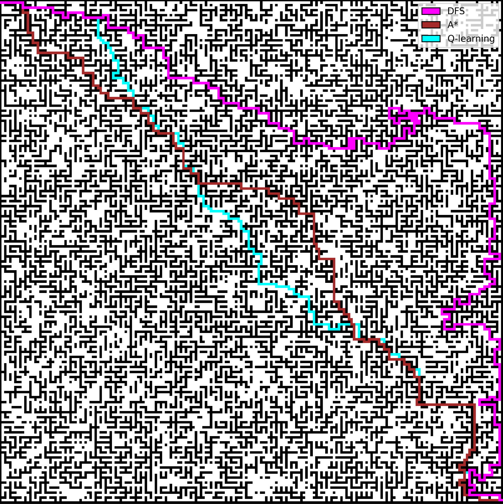

# Maze Solving Methods

A comprehensive comparison and implementation of different maze-solving algorithms including Depth-First Search (DFS), A*, and Q-Learning with neural network-based heuristic learning.



## Authors
- Oskar Wiśniewski (oskarw7)
- Mikołaj Wiszniewski (Weeshsh)
- Franciszek Fabiński (fist-it)

## Overview

This project implements and compares three different approaches to maze solving:
1. **Depth-First Search (DFS)** - A classic graph traversal algorithm
2. **A\* Algorithm** - An informed search algorithm using Manhattan distance heuristic
3. **Q-Learning** - A reinforcement learning approach with reward-based training
4. **Neural Network Heuristic** - A machine learning approach to improve pathfinding, used to improve performance of previously mentioned algorithms

## Maze Generation

The maze generation uses **Kruskal's algorithm** with disjoint set data structure to create connected, acyclic mazes with exactly one path between any two points. Additional walls are randomly removed to create branches and alternative paths, making the maze more complex. To show advantages and drawbacks of solutions, algorithm got slightly changes to allow making mazes more dense in some areas.

## Algorithm Implementations

### 1. Depth-First Search (DFS)

Simple iterative implementation optimized for larger mazes. Uses specific field checking order `[(0, -1), (-1, 0), (0, 1), (1, 0)]` for optimal performance. Paths typically follow upper and right maze edges.

### 2. A* Algorithm

Implements Manhattan distance heuristic, ideal for grid-based 4-directional movement. Produces diagonal paths from entrance to exit with guaranteed optimality.

### 3. Q-Learning

**Key Parameters:**
- 5000 episodes (optimal training time vs. performance)
- Dynamic learning rate (α): 0.5 → 0.01
- Discount factor (β): 0.99
- Exploration rate (ε): decays to 0.1 minimum

**Reward System:** Manhattan distance-based rewards (+1 closer, -1 further) with goal achievement bonus equivalent to A* path length.

### 4. Neural Network Heuristic

Trained on Q-learning data using features: Manhattan distance, movement direction, and surrounding field weights. Uses ReLU hidden layers with dropout and linear output. Training: 100 epochs, batch size 32.

## Performance Comparison

### Standard Maze Results

| Algorithm | Path Length | Execution Time (s) | Visited Nodes |
|-----------|-------------|-------------------|---------------|
| DFS       | 637         | 0.0045           | 857          |
| A*        | 419         | 0.0332           | 11,918       |
| Q-Learning| 433         | 0.0013           | 432          |

*Note: Q-Learning training took 22.55 seconds with 109,992,906 total visited nodes*

### Neural Network Heuristic Results

- **Advantage:** Finds solutions with lower weight sums than A*
- **Disadvantage:** Visits more nodes than A*
- **Scalability:** Successfully scales to larger mazes than training data
- **Limitation:** Computationally expensive training and inference

## Key Findings

1. **DFS**: Simple and fast but produces longer paths
2. **A***: Provides optimal solutions with reasonable computational cost
3. **Q-Learning**: Very fast execution after training but requires significant training time
4. **Neural Network Heuristic**: Can optimize for custom cost functions but computationally expensive

## Technical Requirements

- Python 3.x
- NumPy for numerical computations
- Matplotlib for visualization
- TensorFlow/PyTorch for neural network implementation
- Sufficient computational resources for Q-Learning and neural network trainin

### To run a project:

- install dependencies
    - without uv:
    ``` bash
    python3 -m venv .venv
    source .venv/bin/activate
    pip install -r requirements.txt
    ```
    - with uv:
    ```bash
    uv sync
    ```

- activate virtual environment (if you haven't already)

``` bash
source .venv/bin/activate 
```

- run the program

```bash
make run
```

